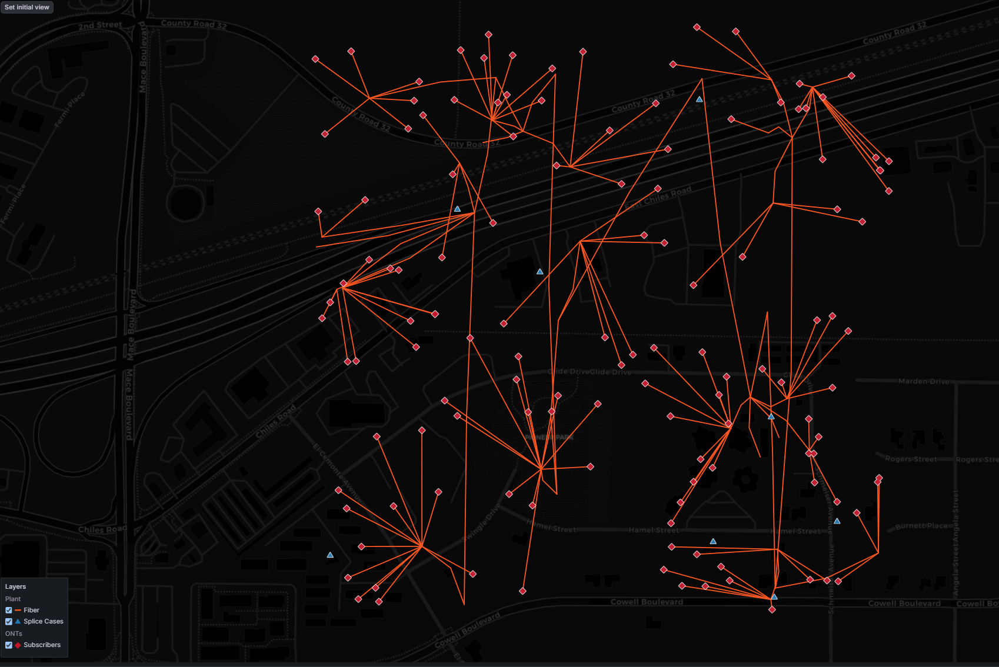
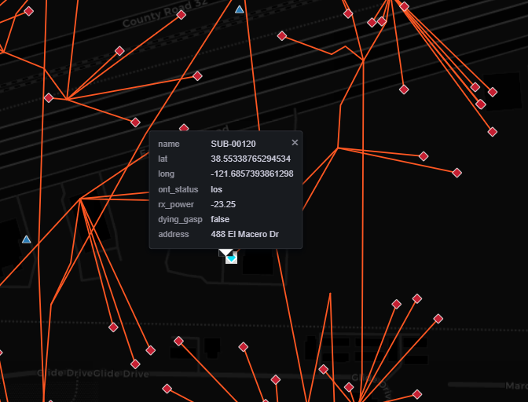
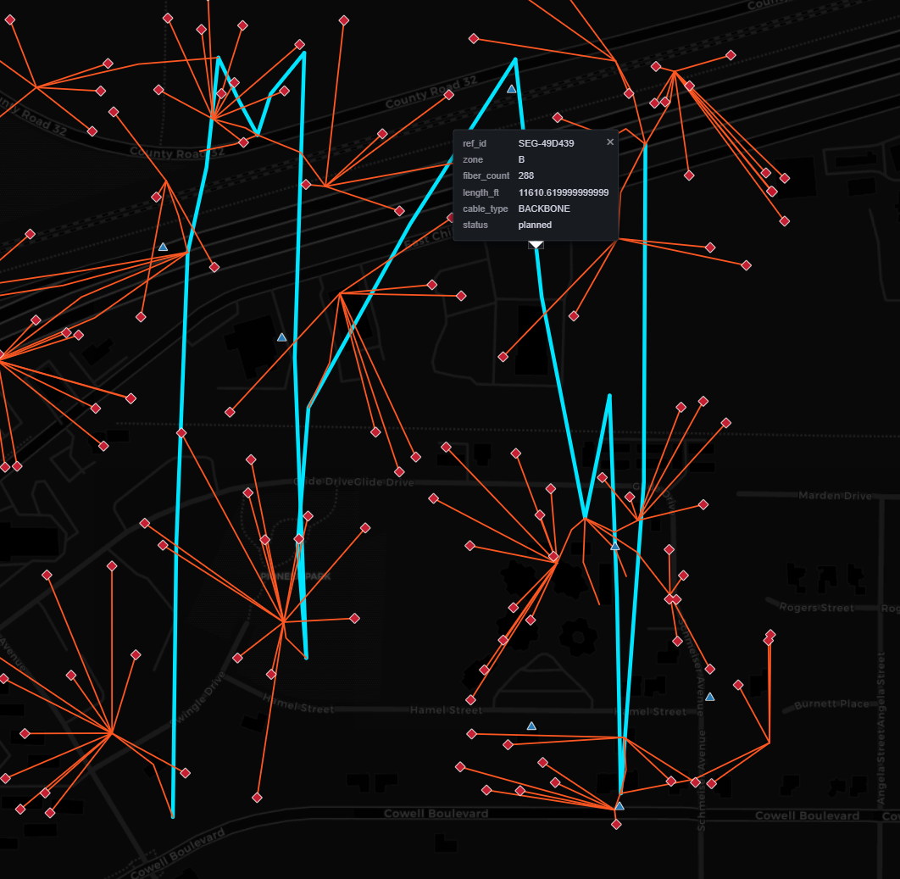
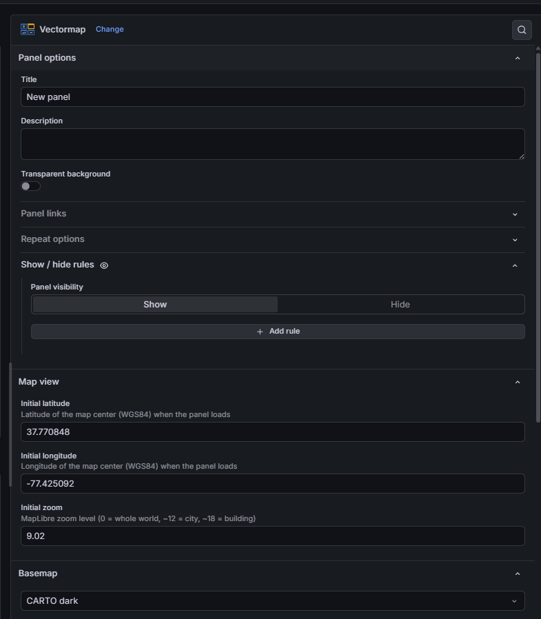
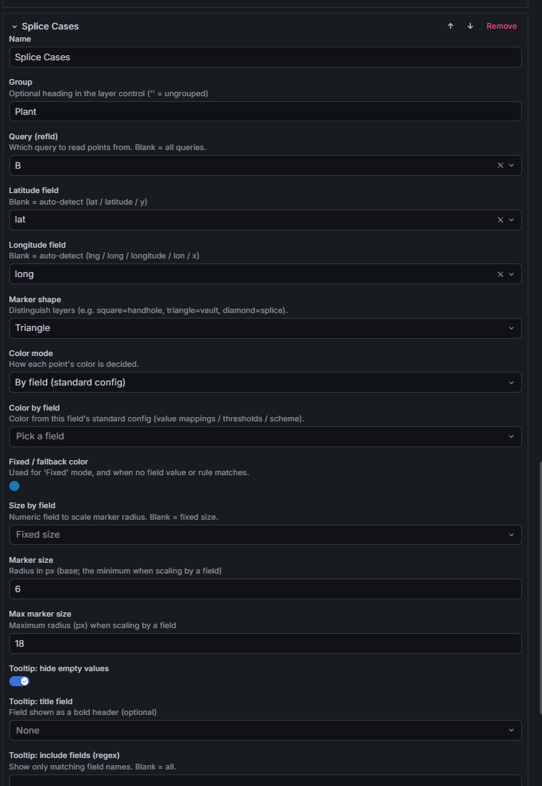
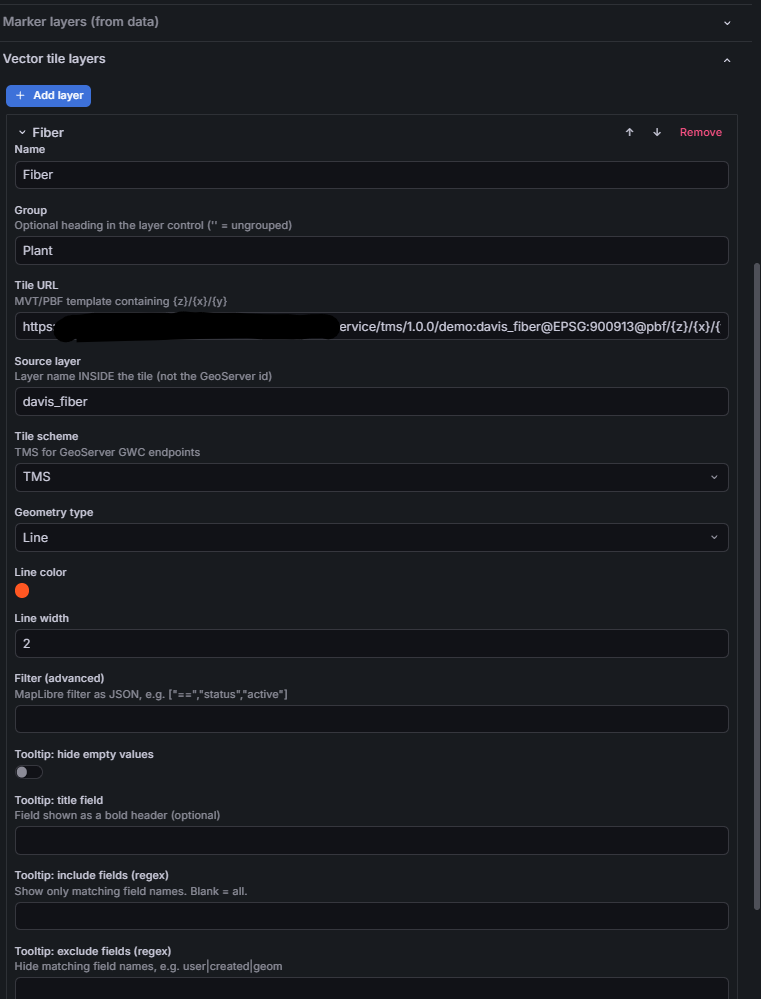

# Vectormap panel for Grafana

A [MapLibre GL JS](https://maplibre.org/) panel plugin for Grafana that renders
vector tile layers (MVT/PBF) and data-driven markers on an interactive map.

Plugin ID: `dander1234-vectormap-panel`

## Why

Grafana's built-in Geomap panel loads geospatial overlays as static GeoJSON,
re-fetching and re-parsing every vertex in the browser on each refresh — which
does not scale to large datasets (fiber routes, plant infrastructure, millions
of vertices). Vectormap instead streams **vector tiles** from a tile server
(GeoServer, Martin, Tegola, or any TMS/XYZ endpoint), so the browser only ever
loads the tiles in view at the current zoom.

## Features

- **Vector tile layers** (MVT/PBF) — tile URL, source layer, geometry/paint,
  optional MapLibre filter, and TMS/XYZ scheme (GeoServer GWC is TMS).
- **Marker layers from query data** (any datasource — SQL, InfluxDB, …), bound
  per query (`refId`), sized by a field, with selectable **shapes**: circle,
  square, triangle, diamond, star, cross, hexagon.
- **Marker color modes** — fixed, by field (Grafana standard config), or explicit
  **thresholds** / **regex** rules defined right on the layer.
- **Unified on-map layer control** — show/hide and group both tile and marker
  layers from one box.
- **Select area** — draw a **box** or freehand **lasso** to list every feature
  inside it (lines/plant segments included when they cross the lasso, not just
  points), across the layers you opt in per layer. Results show in a movable,
  resizable window grouped by layer, with per-layer counts and **CSV export**.
- **Per-layer tooltips** — include/exclude fields by regex, hide empty values, a
  title field, and **templated links** (`${field}` placeholders from the clicked
  feature plus Grafana dashboard variables).
- **Search box** — look up an **address**, **account ID**, or **equipment ID**
  from your query data (per-layer field mappings) and jump to the matching point;
  for addresses it can also fall back to a geocoder on demand (Nominatim by
  default, or a custom endpoint). Flies there, drops a pin, and opens a popup.
- **Basemaps** — OpenStreetMap, CARTO light/dark, Esri satellite, blank, or a
  custom XYZ raster URL.
- **"Set initial view"** button to capture the current center/zoom into options.
- **Grafana template-variable interpolation** in tile/basemap URLs and filters.

## Screenshots

Vector tile plant routes (lines) with data-driven point markers, a grouped layer
control, and feature tooltips:



| Marker tooltip | Vector tile highlight |
| --- | --- |
|  |  |

Configuration — panel options, a marker layer, and a vector tile layer:

| Panel options | Marker layer | Vector tile layer |
| --- | --- | --- |
|  |  |  |

## Install (prebuilt)

To run the plugin in another Grafana without building it:

1. Download the release zip (`dander1234-vectormap-panel-<version>.zip`).
2. Unzip it into Grafana's plugins directory so you have
   `<plugins>/dander1234-vectormap-panel/plugin.json`.
3. Allow the unsigned plugin — in `grafana.ini`:
   ```ini
   [plugins]
   allow_loading_unsigned_plugins = dander1234-vectormap-panel
   ```
   or via env: `GF_PLUGINS_ALLOW_LOADING_UNSIGNED_PLUGINS=dander1234-vectormap-panel`.
4. Restart Grafana and add a **Vectormap** panel.

**Full step-by-step deployment instructions** (prebuilt and from-source,
Grafana config, Docker, CORS/tile-server notes, upgrading) are in
[docs/DEPLOY.md](docs/DEPLOY.md).

## Getting started

Vectormap needs no backend and no external services to try. Add a **Vectormap**
panel to a dashboard (or open the bundled provisioned **"Vectormap demo"**
dashboard) — a basemap renders immediately. From there:

### 1. Pick a basemap

In the panel options, set **Basemap** to OpenStreetMap, CARTO light/dark, Esri
satellite, blank, or a **custom XYZ** raster URL. The map updates live.

To let **viewers** switch basemaps themselves, configure *Basemap → Selectable
basemaps*: a curated list of choices (each a label + kind, plus a URL for Custom).
When non-empty, an on-map **Basemap** picker appears bottom-right and the single
Basemap option above is bypassed (the first choice is the default).

### 2. Add markers from query data (works with built-in TestData)

You don't need a real datasource to see markers. Use Grafana's built-in
**TestData** datasource, scenario **CSV Content**, and paste:

```
lat,lng,name,status
37.7749,-122.4194,San Francisco,up
34.0522,-118.2437,Los Angeles,down
40.7128,-74.0060,New York,up
47.6062,-122.3321,Seattle,degraded
```

Then **Marker layers (from data) → Add marker layer**:

- **Lat/Lng fields** — set to `lat` / `lng`, or leave blank to auto-detect.
- **Shape** — circle, square, triangle, diamond, star, cross, or hexagon.
- **Color mode** — fixed, by field (Grafana standard config), or explicit
  **thresholds** / **regex** rules on a field (e.g. regex on `status`:
  `down` → red, `up` → green).
- **Tooltip** — include/exclude fields by regex, set a title field, and add
  **templated links** such as `https://status.example.com/${name}` that
  interpolate the clicked feature's values.

Click a marker to open its tooltip.

### 3. Add a vector tile layer (public demo endpoint — no GeoServer needed)

Under **Vector tile layers → Add layer**, use MapLibre's public demo tiles:

| Option | Value |
| --- | --- |
| Tile URL | `https://demotiles.maplibre.org/tiles/{z}/{x}/{y}.pbf` |
| Source layer | `countries` |
| Geometry type | `fill` |
| Tile scheme | `XYZ` |

Click **"Set initial view"** while zoomed out (this endpoint serves zoom 0–6)
and the country polygons render from vector tiles. For a real
GeoServer GWC / TMS endpoint, set **Tile scheme = TMS** instead. Tile URLs and
filters accept Grafana **template variables** (e.g. `…/{z}/{x}/{y}.pbf?region=${region}`).

Click a tile feature to open its attribute tooltip. This works even when the
tiles carry no per-feature id (GeoServer omits the optional MVT feature id by
default); in that case the tooltip still renders from the feature's properties,
but the click-highlight ring is only drawn when an id is present. To get
highlighting (and exact Select-area de-dup) on idless tiles, set the layer's
**ID field** to a unique feature property (e.g. `gid` / `fid` / a primary key) —
it is promoted to the feature id.

### 4. Use the on-map layer control

Both marker and tile layers appear in the grouped **layer control** (top-right):
toggle visibility, and assign a **Group** name to related layers to group them
together. Each **group heading has its own checkbox** that shows/hides all layers
in the group at once (tri-state: checked / unchecked / indeterminate when only
some are visible), and a **chevron** to collapse/expand the group's layers (click
the chevron or the group name).

To arrange the control, use *Map view → **Organize layer menu***: drag to reorder
the categories and the layers within each. This sets the menu's display order only
— it doesn't change map draw order or which category a layer belongs to (that's the
layer's Group field).

A marker layer can also define **Point label views** in its options — each a name
plus a data field. When set, that layer's row in the control gets a dropdown so a
viewer can re-display its points as text from the data (e.g. each ONT's `address`
or `account_id`) beside the colored dot, or switch back to **Markers** (dot only).
The dot and its status color are always kept as the anchor. The label text is
formattable per layer — **font style** (Regular / Bold / Italic), **font family**,
**size**, **color**, **halo color**, and **halo width** (blank colors follow the
theme). Fonts are limited to what the glyph server hosts; the built-in default
serves Noto Sans Regular/Bold/Italic. To use other typefaces, point *Point labels
→ Glyph (font) server URL* at a self-hosted glyph server and set the layer's font
family to match.

### 5. Select an area

Click **Select area** (top-left), then choose **Box** or **Lasso**:

- **Box** — drag a rectangle.
- **Lasso** — hold and trace a freehand outline; release to close it.

Everything inside is listed in a movable, resizable **results window**, grouped
by layer with counts. Lines (e.g. plant segments) are included when they cross
the lasso, not only when a vertex is inside. Use **Copy** / **CSV** to export the
list (e.g. affected customers or plant). Each layer has a **Selectable** toggle in
its options, so you can include some layers and exclude others; a layer must also
be **visible** to be selected.

The results table honors each layer's configured **tooltip links**: a link whose
URL references a single field (e.g. `…/equip/${equipment_id}`) makes that
column's values clickable; other links appear in a trailing **Links** column.

> Selection captures the features **rendered at the current zoom and position**
> inside the shape — zoom to the area first for completeness.

### 6. Search by address, account ID, or equipment ID

Use the search box (top-center). As you type, matching rows from your query data
appear under **From data**, each tagged by what matched. A marker layer takes part
in search when you set any of its **Address field**, **Account ID field**, or
**Equipment ID field** (in that layer's options) to the relevant column — e.g.
map an ONT layer's `address`, `account_id`, and `equipment_id`. Pick a result and
the map flies to it, drops a pin, and shows the feature's attributes.

For addresses (only), press **Enter** or **Search web** to look the address up
with the external **geocoder** (configured under *Address search* in panel
options). The **✕** clears the result. You can reword the box's greyed-out hint
via *Address search → Search box placeholder* (blank = the default
"Search address or ID…").

> The default geocoder is **Nominatim** (OpenStreetMap) — free, but rate-limited
> (~1 request/second) and subject to the [OSM usage policy](https://operations.osmfoundation.org/policies/nominatim/);
> please keep OpenStreetMap attribution. For heavier use, set *Geocoder = Custom*
> and point it at your own or a commercial provider. Set *Geocoder = None* to
> search only your query data.

More detail — including troubleshooting and an FAQ — is on the
[project wiki](https://github.com/dander1234/vectormap-panel/wiki).

## Development

Requires Node.js >= 22.

```bash
npm install        # install dependencies
npm run dev        # build in watch mode (rebuilds on save)
npm run build      # production build
npm run typecheck  # TypeScript type checking
npm run lint       # lint
```

The build output lands in `dist/`. To load it in a local Grafana, symlink (or
copy) `dist/` into Grafana's plugins directory under the plugin ID, and allow
the unsigned plugin in `grafana.ini`:

```ini
[plugins]
allow_loading_unsigned_plugins = dander1234-vectormap-panel
```

Then restart Grafana. Changes to frontend code only require a `npm run dev`
rebuild and a browser refresh; changes to `plugin.json` require a Grafana
restart.

## Security

To report a vulnerability, or for an explanation of why `npm audit` advisories
in the externalized Grafana SDK do not ship in the plugin, see
[SECURITY.md](SECURITY.md).

## License

Apache-2.0
